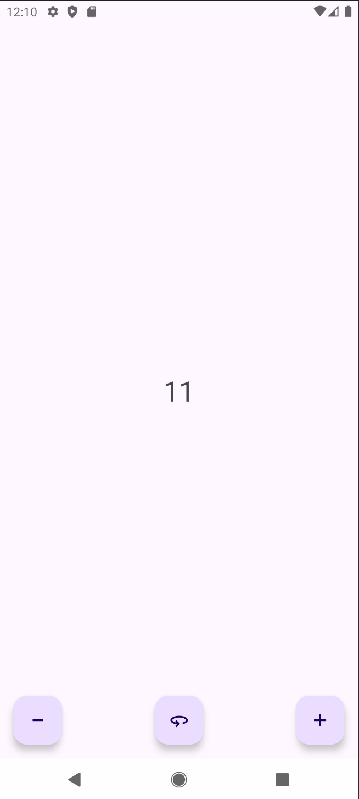
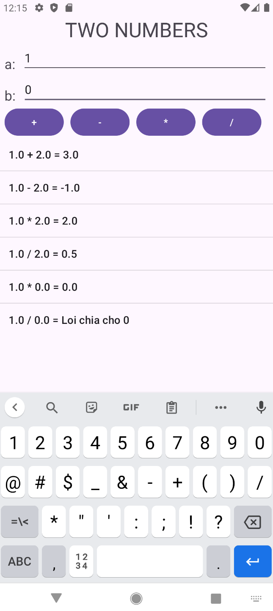
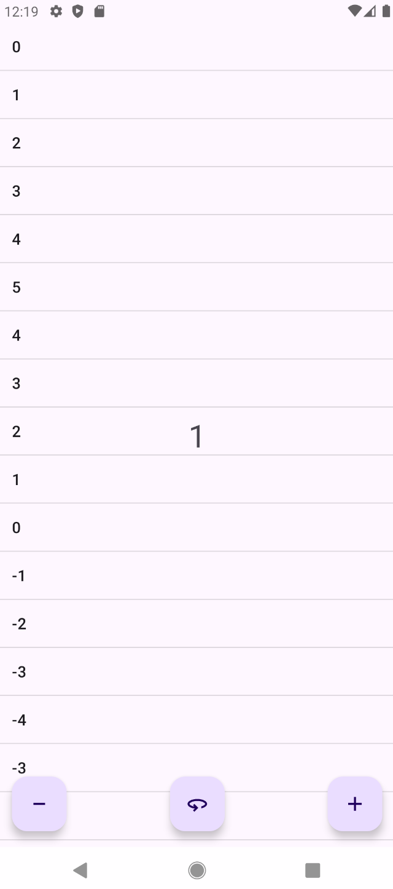
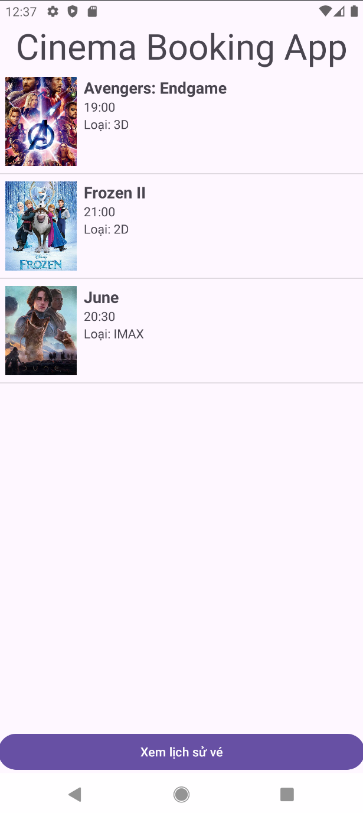

# 📱 **Mobile Programming Exercises (Android)**

This repository contains all **exercises, mini-projects, and lab assignments** for the *Mobile Programming* course using **Android Studio**.
Each exercise is an independent Android project that can be opened directly in Android Studio.

---

## 📑 **Table of Contents**

* [Introduction](#introduction)
* [Application Screenshots](#application-screenshots)
* [Repository Structure](#repository-structure)
* [Technologies Used](#technologies-used)
* [How to Open a Project](#how-to-open-a-project)
* [Android Project Structure](#android-project-structure)
* [.gitignore File](#gitignore-file)
* [Course Objectives](#course-objectives)
* [Contact](#contact)

---

## 🖼️ **Application Screenshots**

You can upload screenshots for each exercise into the folder:

```
Screenshots/
```

### 📌 **Hello World**

#### Demo UI:

<p align="center">
  
</p>

---

### 📌 **Two Number**

#### Demo UI:

<p align="center">
  
</p>

---

### 📌 **Hello World – ListView**

#### Demo UI:

<p align="center">
  
</p>

---

### 📌 **Midterm Exam**

#### Demo UI:

<p align="center">
  
</p>

---

## 📁 **Repository Structure**

```
mobile-programming/
│
├── MidtermExam/                     → Bài thi giữa kỳ (Android Project)
│
├── Practice1_HelloWord/             → Bài tập 1: Hiển thị “Hello World”
│
├── Practice2_TwoNumbers/            → Bài tập 2: Nhập và xử lý hai số
│
├── Practice3_HelloWord_ListView/    → Bài tập 3: HelloWorld nâng cao – ListView
│
├── Practice4_Calculator/            → Bài tập 4: Máy tính đơn giản (Calculator)
│
├── Screenshots/                     → Thư mục chứa ảnh minh họa giao diện
│
└── .gitignore                       → File cấu hình bỏ qua build/cache

```

---

## 🛠 **Technologies Used**

* Android Studio
* Java
* XML Layout
* RecyclerView + Adapter
* Material Components
* SQLite / Room (depending on the exercise)
* ViewBinding / DataBinding
* Gradle Scripts (.kts)

---

## ▶️ **How to Open a Project**

1. Clone the repository:

```sh
git clone https://github.com/<username>/mobile-programming.git
```

2. Open **Android Studio** → **Open**

3. Select the folder of the project you want to run:

```
mobile-programming/BaiTap2_RecyclerView/
```

4. Wait for Gradle to sync → click **Run ▶**

---

## 🧱 **Android Project Structure**

```
app/
 ├── manifests/
 ├── java/
 ├── res/
 └── build.gradle.kts
gradle/
build.gradle.kts
settings.gradle.kts
local.properties
```

---

## 🔒 **.gitignore File**

```gitignore
.gradle/
**/build/
local.properties
.idea/
*.iml
.DS_Store
Thumbs.db
.cxx/
externalNativeBuild/
captures/
```

---

## 🎯 **Course Objectives**

* Understand the Activity lifecycle
* Build UI layouts using XML
* Work with RecyclerView and Adapters
* Store data using SQLite/Room
* Develop small Android applications
* Manage project configuration with Gradle

---

## 📬 **Contact**

📧 *[htthaoduyenit@gmail.com](mailto:htthaoduyenit@gmail.com)*

---
